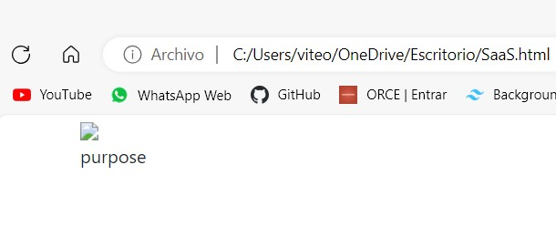

# Actividad: Introducción a HTTP y URI
## Pregunta 1

¿Cuáles son las dos diferencias principales que has visto anteriormente y lo que ves en un navegador web 'normal'? ¿Qué explica estas diferencias?
- Vista local

- Vista Web


### Respuesta 
- La imagen no se muestra: Se debe a qué el llamado de la misma es através de una ruta, tendriamos que tener la imagen descargada para que se visualize.
- El texto no es el mismo: Esto es por la misma configuración de la página la cual muestra un texto distinto cada que se actualiza.

## Pregunta 2
Suponiendo que estás ejecutando curl desde otro shell ¿qué URL tendrás que pasarle a curl para intentar acceder a tu servidor falso y por qué?

### Respuesta 
Segun el comando `ncat -1 8081` se está escuchando el puerto 8081 entonces para acceder a este servidor debemos usar:
```Shell
curl localhost:8081
```

## Pregunta 3
La primera línea de la solicitud identifica qué URL desea recuperar el cliente. ¿Por qué no ves http://localhost:8081 en ninguna parte de esa línea?
```Shell
C:\Users\viteo>ncat -l 8081
GET / HTTP/1.1
Host: localhost:8081
User-Agent: curl/8.0.1
Accept: */*
```
### Respuesta
La razón es que la solicitud HTTP enviada por curl solo contiene la ruta relativa en lugar de la URL completa
## Pregunta 4
Según los encabezados del servidor, ¿cuál es el código de respuesta HTTP del servidor que indica el estado de la solicitud del cliente y qué versión del protocolo HTTP utilizó el servidor para responder al cliente?

```Shell
HTTP/1.1 200 OK
Connection: keep-alive
Content-Type: text/html;charset=utf-8
Content-Length: 480
X-Xss-Protection: 1; mode=block
X-Content-Type-Options: nosniff
X-Frame-Options: SAMEORIGIN
Server: WEBrick/1.4.2 (Ruby/2.6.6/2020-03-31)
Date: Sun, 24 Sep 2023 18:38:16 GMT
Via: 1.1 vegur

<!DOCTYPE html>
<html lang="en">
  <head>
    <meta charset="utf-8">
    <link href="https://cdn.jsdelivr.net/npm/bootstrap@5.0.0-beta1/dist/css/bootstrap.min.css" rel="stylesheet" integrity="sha384-giJF6kkoqNQ00vy+HMDP7azOuL0xtbfIcaT9wjKHr8RbDVddVHyTfAAsrekwKmP1" crossorigin="anonymous">
    <title>Random Word Generator</title>
  <body class="container">
    <div id="image">
      
    </div>
    <div id="word">
      injure
    </div>
  </body>
</html>
```
### Respuesta
- Código de respuesta: `200 OK`
- Versión del protocolo HTTP que se utilizó: `HTTP/1.1`

## Pregunta 5
Cualquier solicitud web determinada puede devolver una página HTML, una imagen u otros tipos de entidades. ¿Hay algo en los encabezados que crea que le dice al cliente cómo interpretar el resultado?.
### Respuesta
Si, los encabezados de respuesta HTTP contienen información que ayudan al cliente a interpretar el resultado devuelto.

## Pregunta 6
¿Cuál sería el código de respuesta del servidor si intentaras buscar una URL inexistente en el sitio generador de palabras aleatorias?
### Respuesta
Se obtiene un código 404
```Shell
HTTP/1.1 404 Not Found
```
## Pregunta 7
¿Qué otros códigos de error HTTP existen? ¿Cuál es la principal diferencia entre 4xx y 5xx?.
### Respuesta
1. Respuestas informativas (100–199)
    - 100 Continue
      Esta respuesta provisional indica que todo hasta ahora está bien y que  el cliente debe continuar con la solicitud o ignorarla si ya está terminada.
    - 101 Switching Protocol
      Este código se envía en respuesta a un encabezado de solicitud por el cliente e indica que el servidor acepta el cambio de protocolo propuesto por el agente de usuario.
    - 102 Processing
      Este código indica que el servidor ha recibido la solicitud y aún se encuentra procesandola, por lo que no hay respuesta disponible.
    - 103 Early Hints
      Este código de estado está pensado principalmente para ser usado con el encabezado Link, permitiendo que el agente de usuario empiece a pre-cargar recursos mientras el servidor prepara una respuesta.
2. Respuestas satisfactorias (200–299)
    - GET: El recurso se ha obtenido y se transmite en el cuerpo del mensaje.
    - HEAD: Los encabezados de entidad están en el cuerpo del mensaje.
    - PUT o POST: El recurso que describe el resultado de la acción se transmite en el cuerpo del mensaje.
    - TRACE: El cuerpo del mensaje contiene el mensaje de solicitud recibido por el servidor.
    - 200 Ok
    - 201 Created
    - 202 Accepted
    - 203 Non Authoritative information
    - 204 No content
    - 205 Reset Content
3. Redirecciones (300–399)
    - 300 Multiple Choice
    Esta solicitud tiene más de una posible respuesta. User-Agent o el usuario debe escoger uno de ellos. No hay forma estandarizada de seleccionar una de las respuestas.
    - 301 Moved Permanently
    Este código de respuesta significa que la URI del recurso solicitado ha sido cambiado. Probablemente una nueva URI sea devuelta en la respuesta.
    - 302 Found
    Este código de respuesta significa que el recurso de la URI solicitada ha sido cambiado temporalmente. Nuevos cambios en la URI serán agregados en el futuro. Por lo tanto, la misma URI debe ser usada por el cliente en futuras solicitudes.
    - 303 See Other
    El servidor envía esta respuesta para dirigir al cliente a un nuevo recurso solicitado a otra dirección usando una petición GET.
    - 304 Not Modified
    Esta es usada para propósitos de "caché". Le indica al cliente que la respuesta no ha sido modificada. Entonces, el cliente puede continuar usando la misma versión almacenada en su caché.
    
4. Errores de los clientes (400–499)
    - 400 Bad Request
    Esta respuesta significa que el servidor no pudo interpretar la solicitud dada una sintaxis inválida.
    - 401 Unauthorized
    Es necesario autenticar para obtener la respuesta solicitada. Esta es similar a 403, pero en este caso, la autenticación es posible
    - 404 Not Found
    El servidor no pudo encontrar el contenido solicitado. Este código de respuesta es uno de los más famosos dada su alta ocurrencia en la web.
    - 405 Method Not Allowed
    El método solicitado es conocido por el servidor pero ha sido deshabilitado y no puede ser utilizado. Los dos métodos obligatorios, GET y HEAD, nunca deben ser deshabilitados y no deberían retornar este código de error.
    - 418 I'm a teapot
    El servidor se rehúsa a intentar hacer café con una tetera.
5. Errores de los servidores (500–599)
    - 500 Internal Server Error
    El servidor ha encontrado una situación que no sabe cómo manejarla.
    - 501 Not Implemented
    El método solicitado no está soportado por el servidor y no puede ser manejado. Los únicos métodos que los servidores requieren soporte (y por lo tanto no deben retornar este código) son GET y HEAD.
    - 502 Bad Gateway
    Esta respuesta de error significa que el servidor, mientras trabaja como una puerta de enlace para obtener una respuesta necesaria para manejar la petición, obtuvo una respuesta inválida.
    - 503 Service Unavailable
    El servidor no está listo para manejar la petición. Causas comunes puede ser que el servidor está caído por mantenimiento o está sobrecargado

- Principal diferencia entre 4xx y 5xx
Los códigos de estado 4xx indican errores que son responsabilidad del cliente que realiza la solicitud mientras que los códigos de estado 5xx indican errores que son responsabilidad del servidor.

## Pregunta 8
Cuando se envía un formulario HTML, se genera una solicitud HTTP POST desde el navegador. Para llegar a tu servidor falso, ¿con qué URL deberías reemplazar Url-servidor-falso en el archivo anterior?
 
### Respuesta
Al escuchar el puerto 8081 usando ncat debemos generar la solicitud POST con la IPv4 de nuestro propio servidor es decir 127.0.0.1 o tambien conocido como localhost entonces tanto http://localhost:8081 como http://127.0.0.1:8081 servirán para llegar a nuestro servidor falso.
```HTML
<!DOCTYPE html>
<html>
<head>
  </head>
  <body> <form method="post" action="http://localhost:8081">
    <label>Email:</label>
     <input type="text" name="email">
      <label>Password:</label>
      <input type="password" name="password">
      <input type="hidden" name="secret_info" value="secret_value">
      <input type="submit" name="login" value="Log In!">
    </form>
  </body>
</html>
```
## Pregunta 9
1. ¿Cómo se presenta al servidor la información que ingresó en el formulario?
2. ¿Qué tareas necesitaría realizar un framework SaaS como Sinatra o Rails para presentar esta información en un formato conveniente a una aplicación SaaS escrita, por ejemplo, en Ruby?
3. ¿Cuál es el efecto de agregar parámetros URI adicionales como parte de la ruta POST?
4. ¿Cuál es el efecto de cambiar las propiedades de nombre de los campos del formulario?
5. ¿Puedes tener más de un botón Submit? Si es así, ¿cómo sabe el servidor en cuál se hizo clic? (Sugerencia: experimenta con los atributos de la etiqueta <submit>).
6. ¿Se puede enviar el formulario mediante GET en lugar de POST? En caso afirmativo, ¿cuál es la diferencia en cómo el servidor ve esas solicitudes?
7. ¿Qué otros verbos HTTP son posibles en la ruta de envío del formulario? ¿Puedes hacer que el navegador web genere una ruta que utilice PUT, PATCH o DELETE?.

### Respuesta
1. El servidor responde de la siguiente manera, se observa que en la última fila están los datos ingresados por el usuario.
```Shell
POST / HTTP/1.1
Host: localhost:8081
Connection: keep-alive
Content-Length: 85
Cache-Control: max-age=0
sec-ch-ua: "Microsoft Edge";v="117", "Not;A=Brand";v="8", "Chromium";v="117"
sec-ch-ua-mobile: ?0
sec-ch-ua-platform: "Windows"
Upgrade-Insecure-Requests: 1
Origin: null
Content-Type: application/x-www-form-urlencoded
User-Agent: Mozilla/5.0 (Windows NT 10.0; Win64; x64) AppleWebKit/537.36 (KHTML, like Gecko) Chrome/117.0.0.0 Safari/537.36 Edg/117.0.2045.41
Accept: text/html,application/xhtml+xml,application/xml;q=0.9,image/webp,image/apng,*/*;q=0.8,application/signed-exchange;v=b3;q=0.7
Sec-Fetch-Site: cross-site
Sec-Fetch-Mode: navigate
Sec-Fetch-User: ?1
Sec-Fetch-Dest: document
Accept-Encoding: gzip, deflate, br
Accept-Language: es-419,es;q=0.9,es-ES;q=0.8,en;q=0.7,en-GB;q=0.6,en-US;q=0.5

email=viteomar537.b%40gmail.com&password=123&secret_info=secret_value&login=Log+In%21
```
2. Para manejar toda esta informacion usando Sinatra o Rails necesitamos seguir los siguientes pasos

- Enrutamiento de la Solicitud: En un framework como Sinatra o Ruby on Rails, la primera tarea es definir rutas que coincidan con la URL proporcionada en la solicitud. Debes configurar el enrutamiento adecuado para manejar la solicitud POST en la ruta "/", que es la raíz en este caso.

- Análisis de la Solicitud: Una vez que la solicitud se ha enrutado correctamente, el framework debe analizar la solicitud HTTP entrante para extraer los datos relevantes. Esto implica extraer los datos del formulario que se encuentran en el cuerpo de la solicitud, que en este caso incluyen campos como "email," "password," "secret_info," y "login."

- Validación de Datos: Antes de procesar los datos, es importante realizar la validación para garantizar que los datos sean válidos y seguros. Esto puede incluir comprobar si se han proporcionado valores para campos requeridos, verificar el formato del correo electrónico, realizar una validación de contraseña segura, etc.

- Procesamiento de Datos: Una vez que los datos se han validado con éxito, puedes realizar cualquier procesamiento adicional necesario. Esto podría incluir el acceso a una base de datos para verificar credenciales, almacenar información en la base de datos, o ejecutar cualquier lógica de negocio requerida.

- Generación de Respuesta: Después de procesar los datos, debes generar una respuesta HTTP adecuada para enviar de vuelta al cliente. Esto podría ser una página HTML de confirmación, una redirección a una página de inicio de sesión, un mensaje de error, o cualquier otra respuesta dependiendo de la lógica de tu aplicación.

- Configuración de Encabezados de Respuesta: Configura los encabezados de respuesta adecuados, como el encabezado "Content-Type," para indicar el tipo de contenido que se envía en la respuesta. Por ejemplo, en este caso, podría ser "text/html."

- Envío de la Respuesta: Finalmente, envía la respuesta al cliente, que en este caso sería el navegador web del usuario que realizó la solicitud.
3. Si enviamos un formulario HTML usando POST, los datos del formulario se envían en el cuerpo de la solicitud HTTP. Es por esto que al añadir paramétros URI el resultado no se ve afectado.
4. Cambiar las propiedades de nombre de los campos del formulario afectará la forma en que se envían y procesan los datos del formulario en el servidor.
5. Sí, se puede tener más de un botón Submit en un formulario HTML. El servidor determina cuál se hizo click dependiendo de su atributo
6. Sí, se puede enviar un formulario mediante el método GET en lugar de POST en HTML. La diferencia principal entre estos dos métodos es cómo se transmiten los datos al servidor y cómo el servidor los interpreta.
7. HTTP permite varios métodos que pueden ser usados en la ruta de envío del formulario, como pueden ser PATCH, PUT y DELETE. Para usar estos métodos se suele usar axios.

## Pregunta 10
Prueba las dos primeras operaciones `GET` anteriores. El cuerpo de la respuesta para la primera debe ser `"Logged in: false"` y para la segunda `"Login cookie set"`. 
¿Cuáles son las diferencias en los encabezados de respuesta que indican que la segunda operación está configurando una cookie? (Sugerencia: usa `curl -v`, que mostrará tanto los encabezados de solicitud como los encabezados y el cuerpo de la respuesta, junto con otra información de depuración. `curl --help` imprimirá una ayuda voluminosa para usar `cURL` y `man curl` mostrará la página del manual de Unix  para cURL en la mayoría de los sistemas.) 

### Respuesta
- Cuerpo de la respuesta para el método GET/
```Shell
*   Trying 54.83.6.65:80...
* Connected to esaas-cookie-demo.herokuapp.com (54.83.6.65) port 80 (#0)
> GET / HTTP/1.1
> Host: esaas-cookie-demo.herokuapp.com
> User-Agent: curl/8.0.1
> Accept: */*
>
< HTTP/1.1 200 OK
< Connection: keep-alive
< Content-Type: text/plain;charset=utf-8
< Content-Length: 16
< X-Content-Type-Options: nosniff
< Server: WEBrick/1.6.1 (Ruby/2.7.8/2023-03-30)
< Date: Tue, 26 Sep 2023 17:05:05 GMT
< Via: 1.1 vegur
<
Logged in: false* Connection #0 to host esaas-cookie-demo.herokuapp.com left intact
```
- Cuerpo de la respuesta para el método GET/login
```Shell
*   Trying 54.146.248.82:80...
* Connected to esaas-cookie-demo.herokuapp.com (54.146.248.82) port 80 (#0)
> GET /login HTTP/1.1
> Host: esaas-cookie-demo.herokuapp.com
> User-Agent: curl/8.0.1
> Accept: */*
>
< HTTP/1.1 200 OK
< Connection: keep-alive
< Content-Type: text/plain;charset=utf-8
< Content-Length: 16
< X-Content-Type-Options: nosniff
< Server: WEBrick/1.6.1 (Ruby/2.7.8/2023-03-30)
< Date: Tue, 26 Sep 2023 17:05:22 GMT
< Set-Cookie: logged_in=true; domain=esaas-cookie-demo.herokuapp.com; path=/; HttpOnly
< Via: 1.1 vegur
<
Login cookie set* Connection #0 to host esaas-cookie-demo.herokuapp.com left intact
```
En la segunda respuesta (GET /login), se puede ver la presencia del encabezado Set-Cookie. Este encabezado se utiliza para establecer una cookie en el navegador del cliente. En este caso, la cookie se llama "logged_in" y tiene el valor "true."

## Pregunta 11
Bien, ahora supuestamente `"logged in"` porque el servidor configuró una cookie que indica esto. Sin embargo, si intentaa `GET /` nuevamente, seguirá diciendo `"Logged: false"`. 
¿Qué está sucediendo? (Sugerencia: `usa curl -v` y observa los encabezados de solicitud del cliente). 
### Respuesta
Para solucionar este problema, tenemos que decirle a curl que almacene las cookies relevantes que envía el servidor, para que sepa incluirlas en futuras solicitudes a ese servidor. Debemos verificar que el archivo `cookies.txt` recién creado contenga información sobre la cookie que coincida con el encabezado `Set-Cookie` de el servidor
```Shell
HTTP/1.1 200 OK
Connection: keep-alive
Content-Type: text/plain;charset=utf-8
Content-Length: 16
X-Content-Type-Options: nosniff
Server: WEBrick/1.6.1 (Ruby/2.7.8/2023-03-30)
Date: Tue, 26 Sep 2023 17:10:52 GMT
Set-Cookie: logged_in=true; domain=esaas-cookie-demo.herokuapp.com; path=/; HttpOnly
Via: 1.1 vegur

Login cookie set
```
Ahora debemos decirle a curl que incluya las cookies apropiadas de este archivo cuando visite el sitio
```Shell
*   Trying 54.83.6.65:80...
* Connected to esaas-cookie-demo.herokuapp.com (54.83.6.65) port 80 (#0)
> GET / HTTP/1.1
> Host: esaas-cookie-demo.herokuapp.com
> User-Agent: curl/8.0.1
> Accept: */*
> Cookie: logged_in=true
>
< HTTP/1.1 200 OK
< Connection: keep-alive
< Content-Type: text/plain;charset=utf-8
< Content-Length: 15
< X-Content-Type-Options: nosniff
< Server: WEBrick/1.6.1 (Ruby/2.7.8/2023-03-30)
< Date: Tue, 26 Sep 2023 17:12:00 GMT
< Via: 1.1 vegur
<
Logged in: true* Connection #0 to host esaas-cookie-demo.herokuapp.com left intact
```
Tenemos como resultado `Logged in: true*` el cual verifica que la cookie ahora se transmita y que el servidor ahora crea que ha iniciado sesión.

## Pregunta 12
Al observar el encabezado `Set-Cookie` o el contenido del archivo `cookies.txt`, parece que podría haber creado fácilmente esta cookie y simplemente obligar al servidor a creer que ha iniciado sesión. En la práctica, ¿cómo evitan los servidores esta inseguridad? 
### Respuesta
Las prácticas de seguridad relacionadas con las cookies incluyen el firmado de cookies mediante cifrado o hash y una clave secreta en el servidor para garantizar que no se hayan modificado, el uso de tokens de sesión únicos en lugar de almacenar datos de sesión directamente en las cookies, el establecimiento de fechas de vencimiento en las cookies para limitar su validez temporal, la obligación de conexiones seguras (HTTPS) para solicitudes con cookies válidas, y la implementación de políticas de cookies que especifican su manejo, como la restricción a conexiones seguras y la limitación de acceso a scripts del mismo origen (SameSite), con el objetivo de proteger la privacidad y la integridad de los datos de sesión del usuario.
