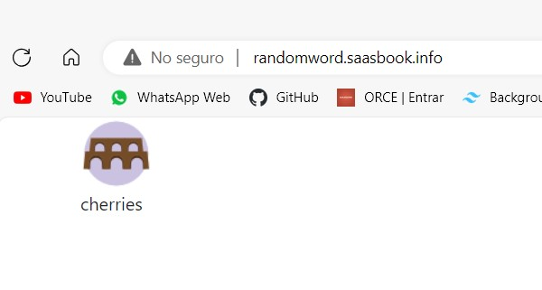

# Actividad: Introducción a HTTP y URI
## Pregunta 1

¿Cuáles son las dos diferencias principales que has visto anteriormente y lo que ves en un navegador web 'normal'? ¿Qué explica estas diferencias?
- Vista local

- Vista Web


### Respuesta 
- La imagen no se muestra: Se debe a qué el llamado de la misma es através de una ruta, tendriamos que tener la imagen descargada para que se visualize.
- El texto no es el mismo: Esto es por la misma configuración de la página la cual muestra un texto distinto cada que se actualiza.

## Pregunta 2
Suponiendo que estás ejecutando curl desde otro shell ¿qué URL tendrás que pasarle a curl para intentar acceder a tu servidor falso y por qué?

### Respuesta 
Segun el comando `ncat -1 8081` se está escuchando el puerto 8081 entonces para acceder a este servidor debemos usar:
```Shell
curl localhost:8081
```

## Pregunta 3
La primera línea de la solicitud identifica qué URL desea recuperar el cliente. ¿Por qué no ves http://localhost:8081 en ninguna parte de esa línea?
```Shell
C:\Users\viteo>ncat -l 8081
GET / HTTP/1.1
Host: localhost:8081
User-Agent: curl/8.0.1
Accept: */*
```
### Respuesta
La razón es que la solicitud HTTP enviada por curl solo contiene la ruta relativa en lugar de la URL completa
## Pregunta 4
Según los encabezados del servidor, ¿cuál es el código de respuesta HTTP del servidor que indica el estado de la solicitud del cliente y qué versión del protocolo HTTP utilizó el servidor para responder al cliente?

```Shell
HTTP/1.1 200 OK
Connection: keep-alive
Content-Type: text/html;charset=utf-8
Content-Length: 480
X-Xss-Protection: 1; mode=block
X-Content-Type-Options: nosniff
X-Frame-Options: SAMEORIGIN
Server: WEBrick/1.4.2 (Ruby/2.6.6/2020-03-31)
Date: Sun, 24 Sep 2023 18:38:16 GMT
Via: 1.1 vegur

<!DOCTYPE html>
<html lang="en">
  <head>
    <meta charset="utf-8">
    <link href="https://cdn.jsdelivr.net/npm/bootstrap@5.0.0-beta1/dist/css/bootstrap.min.css" rel="stylesheet" integrity="sha384-giJF6kkoqNQ00vy+HMDP7azOuL0xtbfIcaT9wjKHr8RbDVddVHyTfAAsrekwKmP1" crossorigin="anonymous">
    <title>Random Word Generator</title>
  <body class="container">
    <div id="image">
      
    </div>
    <div id="word">
      injure
    </div>
  </body>
</html>
```
### Respuesta
- Código de respuesta: `200 OK`
- Versión del protocolo HTTP que se utilizó: `HTTP/1.1`

## Pregunta 5
Cualquier solicitud web determinada puede devolver una página HTML, una imagen u otros tipos de entidades. ¿Hay algo en los encabezados que crea que le dice al cliente cómo interpretar el resultado?.
### Respuesta
Si, los encabezados de respuesta HTTP contienen información que ayudan al cliente a interpretar el resultado devuelto.

## Pregunta 6
¿Cuál sería el código de respuesta del servidor si intentaras buscar una URL inexistente en el sitio generador de palabras aleatorias?
### Respuesta
Se obtiene un código 404
```Shell
HTTP/1.1 404 Not Found
```
## Pregunta 7
¿Qué otros códigos de error HTTP existen? ¿Cuál es la principal diferencia entre 4xx y 5xx?.
### Respuesta
1. Respuestas informativas (100–199)
    - 100 Continue
      Esta respuesta provisional indica que todo hasta ahora está bien y que  el cliente debe continuar con la solicitud o ignorarla si ya está terminada.
    - 101 Switching Protocol
      Este código se envía en respuesta a un encabezado de solicitud por el cliente e indica que el servidor acepta el cambio de protocolo propuesto por el agente de usuario.
    - 102 Processing
      Este código indica que el servidor ha recibido la solicitud y aún se encuentra procesandola, por lo que no hay respuesta disponible.
    - 103 Early Hints
      Este código de estado está pensado principalmente para ser usado con el encabezado Link, permitiendo que el agente de usuario empiece a pre-cargar recursos mientras el servidor prepara una respuesta.
2. Respuestas satisfactorias (200–299)
    - GET: El recurso se ha obtenido y se transmite en el cuerpo del mensaje.
    - HEAD: Los encabezados de entidad están en el cuerpo del mensaje.
    - PUT o POST: El recurso que describe el resultado de la acción se transmite en el cuerpo del mensaje.
    - TRACE: El cuerpo del mensaje contiene el mensaje de solicitud recibido por el servidor.
    - 200 Ok
    - 201 Created
    - 202 Accepted
    - 203 Non Authoritative information
    - 204 No content
    - 205 Reset Content
3. Redirecciones (300–399)
    - 300 Multiple Choice
    Esta solicitud tiene más de una posible respuesta. User-Agent o el usuario debe escoger uno de ellos. No hay forma estandarizada de seleccionar una de las respuestas.
    - 301 Moved Permanently
    Este código de respuesta significa que la URI del recurso solicitado ha sido cambiado. Probablemente una nueva URI sea devuelta en la respuesta.
    - 302 Found
    Este código de respuesta significa que el recurso de la URI solicitada ha sido cambiado temporalmente. Nuevos cambios en la URI serán agregados en el futuro. Por lo tanto, la misma URI debe ser usada por el cliente en futuras solicitudes.
    - 303 See Other
    El servidor envía esta respuesta para dirigir al cliente a un nuevo recurso solicitado a otra dirección usando una petición GET.
    - 304 Not Modified
    Esta es usada para propósitos de "caché". Le indica al cliente que la respuesta no ha sido modificada. Entonces, el cliente puede continuar usando la misma versión almacenada en su caché.
    
4. Errores de los clientes (400–499)
    - 400 Bad Request
    Esta respuesta significa que el servidor no pudo interpretar la solicitud dada una sintaxis inválida.
    - 401 Unauthorized
    Es necesario autenticar para obtener la respuesta solicitada. Esta es similar a 403, pero en este caso, la autenticación es posible
    - 404 Not Found
    El servidor no pudo encontrar el contenido solicitado. Este código de respuesta es uno de los más famosos dada su alta ocurrencia en la web.
    - 405 Method Not Allowed
    El método solicitado es conocido por el servidor pero ha sido deshabilitado y no puede ser utilizado. Los dos métodos obligatorios, GET y HEAD, nunca deben ser deshabilitados y no deberían retornar este código de error.
    - 418 I'm a teapot
    El servidor se rehúsa a intentar hacer café con una tetera.
5. Errores de los servidores (500–599)
    - 500 Internal Server Error
    El servidor ha encontrado una situación que no sabe cómo manejarla.
    - 501 Not Implemented
    El método solicitado no está soportado por el servidor y no puede ser manejado. Los únicos métodos que los servidores requieren soporte (y por lo tanto no deben retornar este código) son GET y HEAD.
    - 502 Bad Gateway
    Esta respuesta de error significa que el servidor, mientras trabaja como una puerta de enlace para obtener una respuesta necesaria para manejar la petición, obtuvo una respuesta inválida.
    - 503 Service Unavailable
    El servidor no está listo para manejar la petición. Causas comunes puede ser que el servidor está caído por mantenimiento o está sobrecargado

- Principal diferencia entre 4xx y 5xx
Los códigos de estado 4xx indican errores que son responsabilidad del cliente que realiza la solicitud mientras que los códigos de estado 5xx indican errores que son responsabilidad del servidor.

## Pregunta 8
Cuando se envía un formulario HTML, se genera una solicitud HTTP POST desde el navegador. Para llegar a tu servidor falso, ¿con qué URL deberías reemplazar Url-servidor-falso en el archivo anterior?
 
### Respuesta
  


